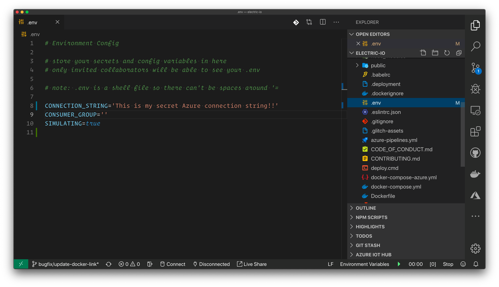

In situations where you are showing code to others, one thing you need to be aware of is what potentially sensitive code you are showing. Situations include streaming on Twitch or demo code in front of a presentation audience or clients.

## Fine then, keep your secrets



It's common to use an environment-loading tool like `dotenv` to pull secrets in from a file that has been hidden from source control via `.gitignore`.

However, if you accidentally click on this file, it will open in your editor, revealing all your secrets to your audience! If you do this, you'll find yourself needing to immediate rotate secrets, which can be quite the interruption to an otherwise smooth code demo session.

## How to do it

In your VS Code file browser find or create a directory named `.vscode`. Inside that directory, find or create a file named `settings.json`.

In `settings.json`, add the following configuration, and save the file:

```javascript
{
  "files.exclude": {
    "**/*.env": true
  }
}
```

Instantly you will see the secret files disappear from the file browser in VS Code! No more accidentally clicking it and opening in front of the whole world.

## But wait, how can I undo that

Pretty easy. You can delete that settings entry in your `.vscode/settings.json` file. Or, if you have a particular env file you _want_ to be visible, for example, the `.env` file in a direcory of `demo/example1`, change your `.vscode/settings.json` file to this:

```javascript
{
  "files.exclude": {
    "**/*.env": true,
    "demo/example1/.env": false
  }
}
```

## Wrap it up, already

I personally use this technique when I stream Live Coding on Twitch. In times where I need to read/write to these hidden files, I will do that with VIM on a different, non-displayed monitor.

I hope you find this tip useful. Be safe out there, and keep your secrets safe!
