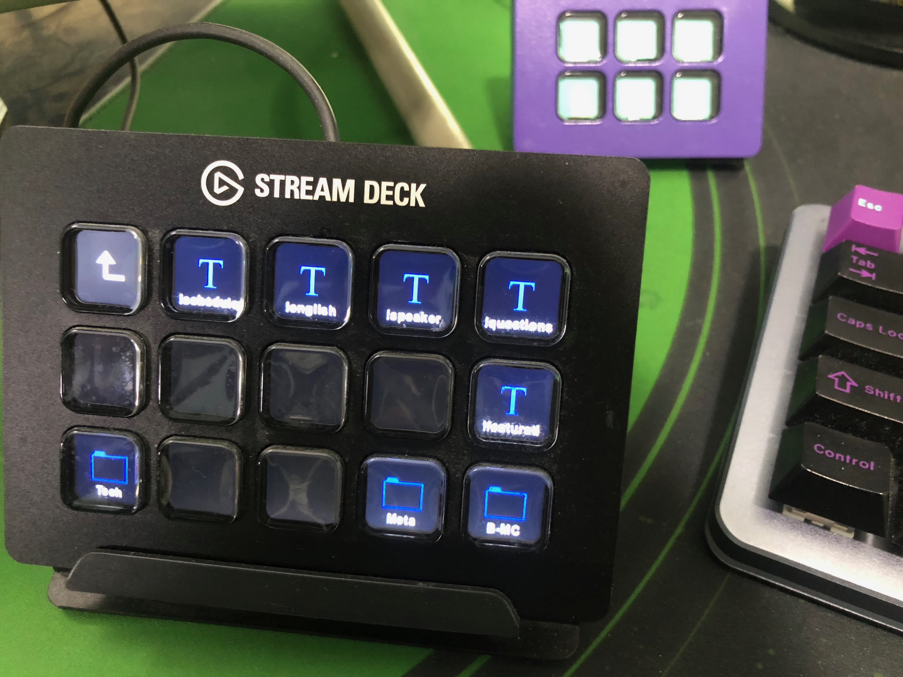
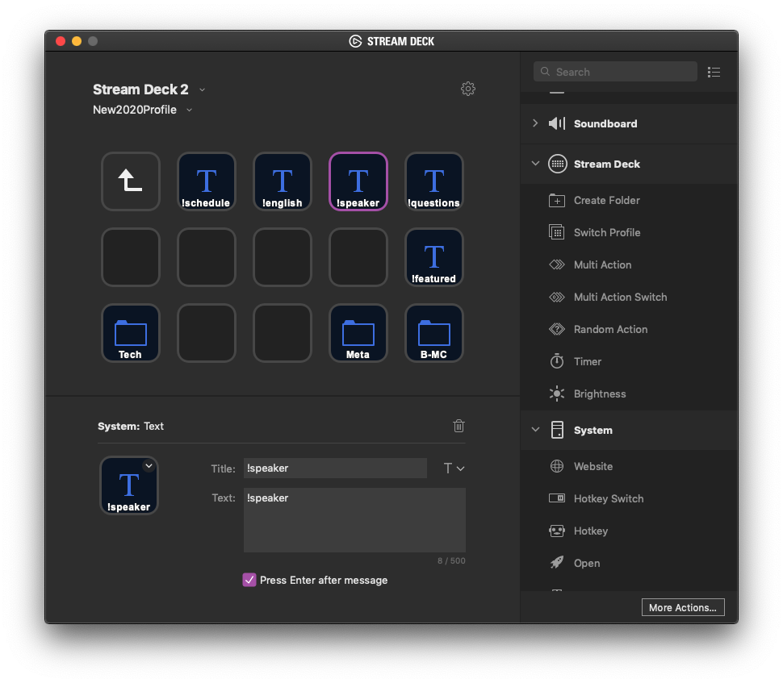

Moderating a conference stream on Twitch that peaked at over 13,000 live viewers came with challenges. I reached for a hardware tool called StreamDeck to assist me.

### What is a Streamdeck

A hardware device and accompanying software from Elgato. Primarily used by streamers on platforms like Twitch/Mixer to handle quick commands like switching OBS scenes, or controlling microphones and cameras.

There is a backlit LCD screen behind the buttons which allows customizing the icon and text on the button. Via the use of folders, you can have many many nested layers of buttons. You can also switch to different entire profiles that contain completely different sets of buttons and actions.

### How I Used It

For the recent The Live Coders Conference, April 9th 2020, I was on the moderation team. As a team we were developing quick bot commands that are executed like so: '!questions'. Typing that in chat would get a bot response we prepared.

We continued to learn from the experience and come up with new commands we needed. After about 5 of these, I knew I needed to bring in a tool to help me not only remember all of them but quickly execute the commands. That's where the StreamDeck came in. Fortunately as a fellow streamer, I even had two of these to choose from, a six-button and a fifteen-button.

The command type was the extremely basic 'Text' type. The important part is to select the option to send enter after. This allows for entering the command in the stream chat input box, and firing it into the chat.

_Naturally, my fellow moderators thought I was a robot, until I revealed my secret._

To further illustrate why this was a fantastic idea, just look at a small selection of the commands we were regularly using:

- !schedule
- !english
- !speaker
- !questions
- !featured
- !recording
- !issues
- !audio
- !website
- !twitter
- !water
- !heatmap

Whew, that is quite a bit to memorize and keep typing over and over during a 15-hour moderation duty.

## Other Ideas

- Add quick chat commands and emotes for your favorite streamers
- Create either a layer per stream, or a separate profile
- Use as a viewer OR as a moderator
- Setting stream markers for later post-processing, clips, or highlights
- Add commands like slow chat, follower only mode, or clear chat history
