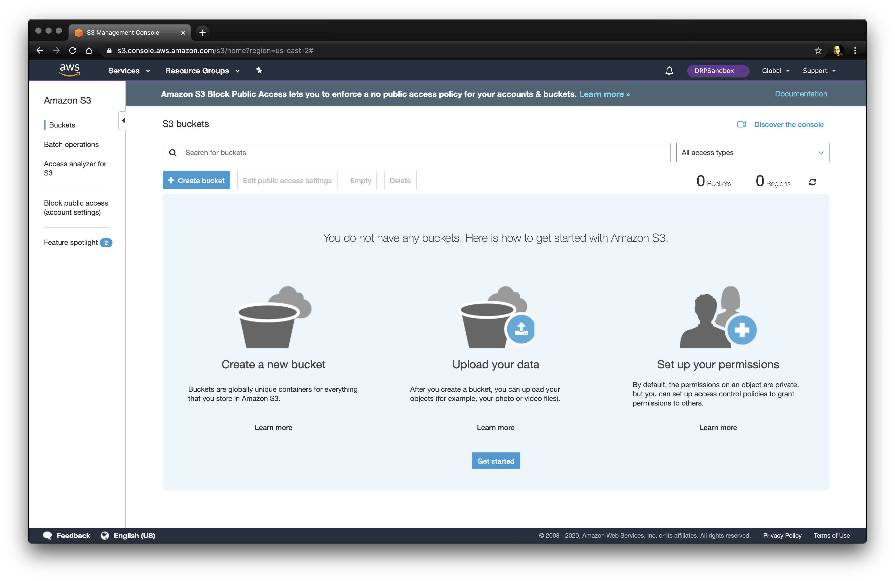
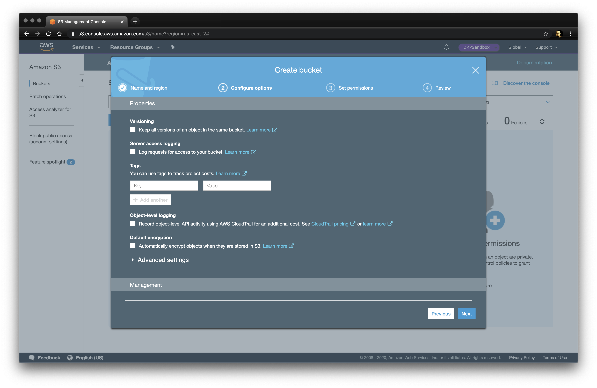
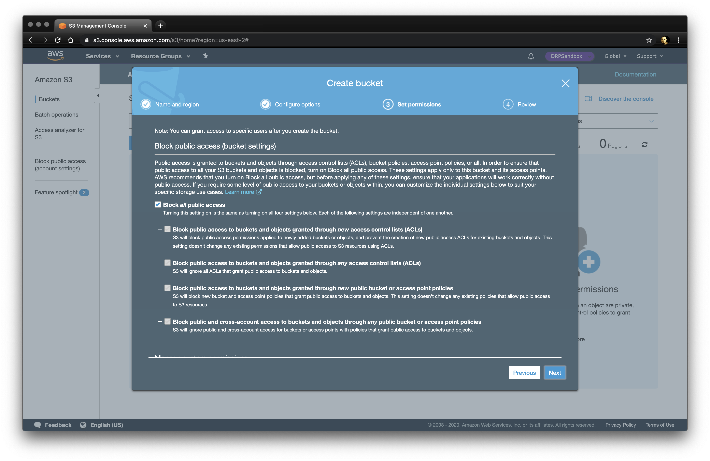
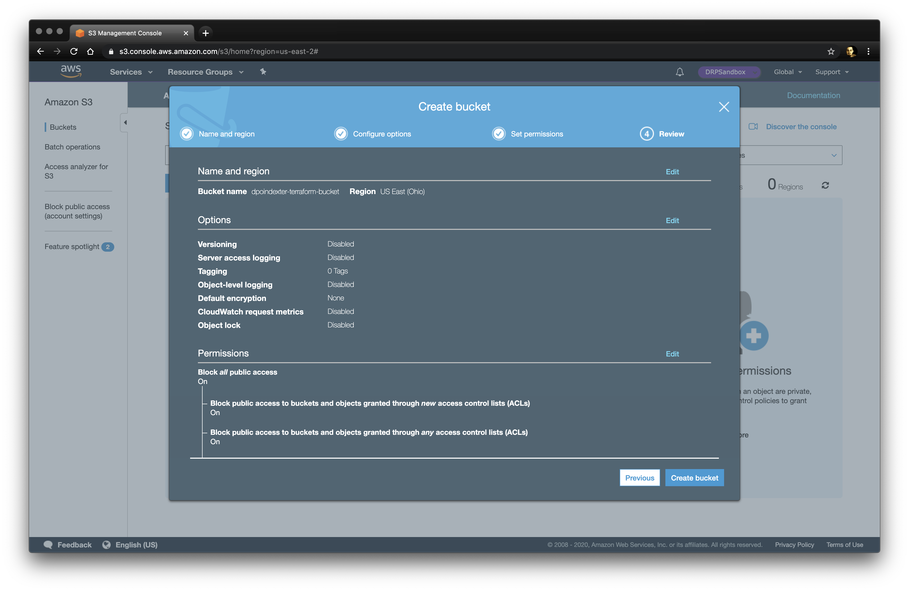
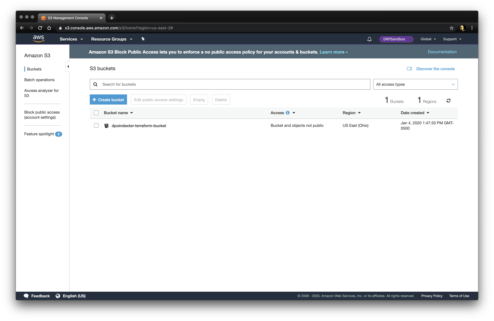
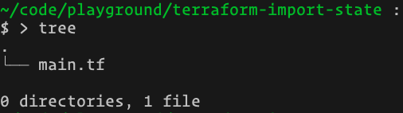
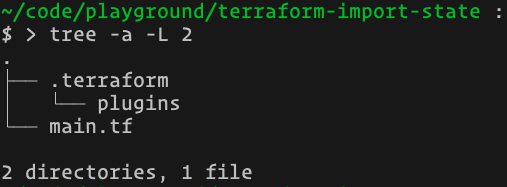
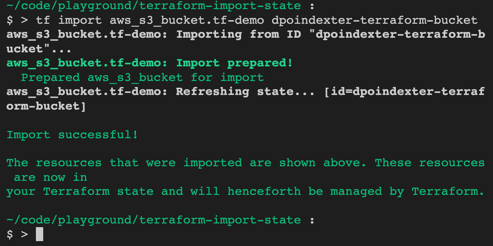
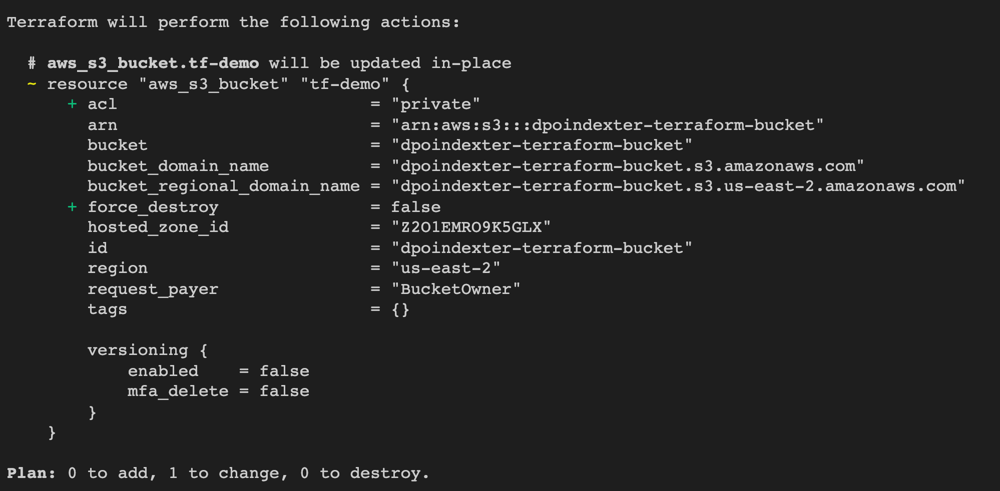
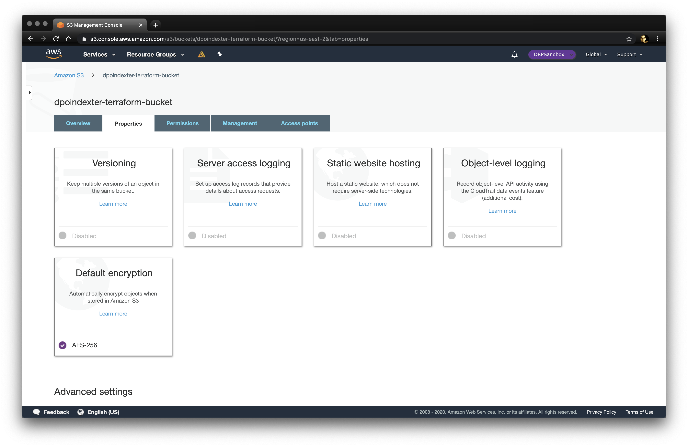

## What to do with existing cloud resources

Terraform is fantastic for creating and tracking resources, changes to resources, and destroying resources. But what if you already have AWS resources made long before you ever heard of Terraform? Maybe long before you even started at your company?

All is not lost! Let's learn this together...

It is possible to import existing resources into Terraform state managment. Depending on the resources and the providers, it can be simple, or painful. _It's a known issue, and the latter is not what we are tackling today._

### Intro to task

State: We have an AWS S3 bucket. _Well we are gonna make one._ And we want to do a few things:

- Record the existence of the bucket in Terraform State
- Reflect the state in Terraform code
- Modify an attribute the right way, from code
- And deploy that modification to the real world

### Create a bucket

Here we are in S3 with no buckets at all. We need to set up our example to be more like the real world where you likely have TONs of buckets set up.



So we make a bucket and give it a unique name. Remember, S3 buckets are a quasi-global resource. They are stored per-region, but the names are Fully Qualified Domain Names.

We're taking ALL the defaults, nothign special here. No versioning, access logging, nothing.



And it's a private bucket, as well it should be, _which is the default in AWS S3_.



We do a quick review...



And there's our bucket.



With no additional features. **We'd really like to enable default encryption!**


But it's completly made in the console (the AWS UI), and not controlled by infrastructure as code at all, oof.

Now lets fix that problem.

### Create some terraform

Without going into a ton of detail about Terraform state management best practices _(don't worry, this blog's future posts and my twitch stream is the best place for all that)_, we're gonna keep it very simple.

Make a directory with a single file in it and change into it. We'll just go with a file named `main.tf`. You should have a structure that looks like this:



Inside `main.tf` we're going to add the absolute minimum to use Terraform and start tracking an AWS S3 Bucket resource.

You need to define the AWS Provider (and optionally version of the provider, if that's your jam), as well as the resource type, and the bucket name. It looks like this:

```HCL
provider "aws" {
  region  = "us-east-2"
  version = "~> 2.43"
}

resource "aws_s3_bucket" "tf-demo" {
  bucket = "dpoindexter-terraform-bucket"
}
```

Now you need to initialize the Terraform state (if you're doing this from scratch, as we are).

```bash
terraform init
```

Now we have the provider downloaded for our machine. In this case, the AWS provider at version 2.43-ish. your directory structure will look like this



### Run the import command

So, we technically "have terraform" but.. it doesn't point to a dang thing. Now you techinically could just run a `terraform plan` and see that it would want to modify a bunch of attributes of that bucket, but it's all "known after apply" and that can be **very risky**.

_In our simple example, since we took all the bucket defaults, it probably would be fine. But what if it wasn't? We want to show the right way, don't we?_

So now let's run the import command. It looks like this in our case:

```bash
tf import aws_s3_bucket.tf-demo dpoindexter-terraform-bucket
```

And here is what each part means:

- terraform import: The import command
- aws_s3_bucket: The resource type in the terraform code
- tf-demo: The resource name in the terraform code that we gave it
- dpoindexter-terraform-bucket: The actual existing bucket name

On success, here's what that would look like



_Note: For my own professional convenience, I use a bash alias for tf=terraform_

Let's see what we have to work with...

### Sync up some differences and apply

```bash
terraform plan
```

When we run this, we can see a difference between the "Quorum of 3" vote.



#### What do those pluses mean

The ACL is unique to the S3 resrouce of the AWS provider. Remember when we created the S3 bucket with private-only access? Well... that wasn't _actually_ a private ACL. Here the provider is wanting to add an explicity ACL set to private. This is fine. But we will put it in our code.

The `force_destroy` is not an S3 thing. Or even an AWS thing. This is a Terraform thing. This lets us choose whether to "update if you can update" or "I don't care if you can just update, I'd prefer you just destroy and recreate the resource."

The default for S3 is going to be false. Destruction and recreate of S3 is problematic because, as mentioned earlier, it's a Fully Qualified Domain Name. Which means... you could destroy it... and somebody else could make a bucket with YOUR NAME and your build will fail. Not good.

We'll also reflect this back into our code.

#### What about the other things

Those are properties that are in the state, but not reflected in our terraform code. Essentially, they are tracked in state, but our code does not conflict with the quorum vote. This is fine. This is fine. For now.

We won't feflect these others into our code at the moment. But you 100% could if you really want to be specific.

Here's what we look like now

```HCL
provider "aws" {
  region  = "us-east-2"
  version = "~> 2.43"
}

resource "aws_s3_bucket" "tf-demo" {
  bucket        = "dpoindexter-terraform-bucket"
  acl           = "private"
  force_destroy = false
}

```

Go ahead and run an apply, and now boom... you have a bucket tracked under Terraform State control AND Terraform code. Let's go further!

```bash
terraform apply
...
Enter a value: yes
...
aws_s3_bucket.tf-demo: Modifying... [id=dpoindexter-terraform-bucket]
aws_s3_bucket.tf-demo: Modifications complete after 3s [id=dpoindexter-terraform-bucket]

Apply complete! Resources: 0 added, 1 changed, 0 destroyed.
```

### Make some changes

Remember, we wanted to enable that sweet-sweet default AES256 encryption for the bucket! Let's do that with code, instead of clicking around in the AWS Console. Add this to the `main.tf` file in the bucket resource.

```HCL
  server_side_encryption_configuration {
    rule {
      apply_server_side_encryption_by_default {
        sse_algorithm = "AES256"
      }
    }
  }
```

It should look like this now

```HCL
provider "aws" {
  region  = "us-east-2"
  version = "~> 2.43"
}

resource "aws_s3_bucket" "tf-demo" {
  bucket        = "dpoindexter-terraform-bucket"
  acl           = "private"
  force_destroy = false
  server_side_encryption_configuration {
    rule {
      apply_server_side_encryption_by_default {
        sse_algorithm = "AES256"
      }
    }
  }
}

```

Now we apply those changes!

```bash
terraform apply
...
Enter a value: yes
...
aws_s3_bucket.tf-demo: Modifying... [id=dpoindexter-terraform-bucket]
aws_s3_bucket.tf-demo: Modifications complete after 3s [id=dpoindexter-terraform-bucket]

Apply complete! Resources: 0 added, 1 changed, 0 destroyed.
```

### Verify the changes

Now don't get me wrong, accessing the AWS Console is still good! I personally like to pop in and just second-guess, gut-check that things really really really did work.

So let's take a look. You should see the properties of the bucket have changed to reflect that Default Encryption AES-256 is now enabled.



### Wrap up and congrats

Today we saw how you can take some existing resources and iteratively import them into your Infrastructure as Code.

_While I fully admit this example was pretty simple and relatively painless, don't think that means everything else is difficult. The enhanced output in the recent versions of Terraform have made the "reflect changes back" part much easier._

No go forth and get that cloud under control!
