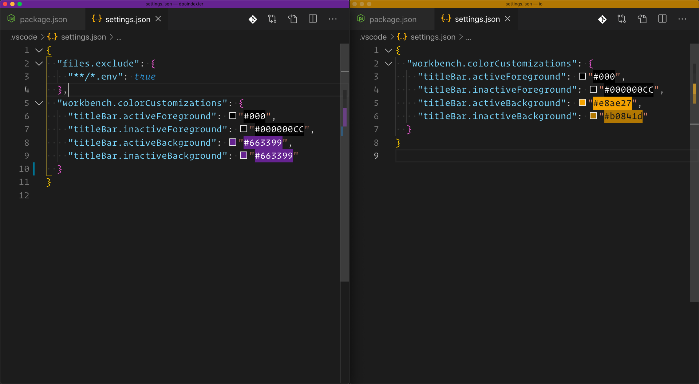

I often find myself with a BUNCH of VS Code windows open during any given day. It could be a variety of projects, or even just different aspects of the same project.

## And you get a window, and you get a window



- Situation 1: Frontend repo, backend repo
- Situation 2: I know my _other_ project has what I need, open both of them!
- Situation 3: A `M O N O R E P O` with frontend React code, backend Node.js code, persistence layer database code, in different folders, but same git repository.
  - Pro: Same language for everything
  - Con: It all looks the same!

Let's make the cognitive context switching blatantly obvious when you move between them. With beautiful colors!

### How do we do it

Let's make our VS Code top bar rebeccapurple when we are in the react code.

In your VS Code file browser find or create a directory named `.vscode`. Inside there, find or create a file named `settings.json`.

In `settings.json`, add the following configuration, and save the file:

```javascript
{
  "workbench.colorCustomizations": {
    "titleBar.activeForeground": "#000",
    "titleBar.inactiveForeground": "#000000CC",
    "titleBar.activeBackground": "#663399"
  }
}
```

_Note: To customize the title bars in Linux, you may need to go to Settings > Window > Title Bar Style and change it from "Native" to "Custom" Special thanks to @phrakberg for that heads up!_

You can then make any of these VS Code windows uniquely colored by using the same technique. **Your rainbow awaits!**

### Customize all the things

_Disclaimer: I do not currently use the solutions mentioned in this section. However a trusted community member on Twitch recommended this, and I'm interested in trying it out, myself._

When you start using this technique and want a little more power, you can style other parts of your VS Code window beyond just the title bar.

One extension that can help you manage all those setting is [Peacock, by John Papa, on the VS Code Marketplace](https://marketplace.visualstudio.com/items?itemName=johnpapa.vscode-peacock).

### How are you using this

If you try this out, let me know! I'm always curious to hear how creative people find solutions, and encourage sharing to all of us! [Let me know on Twitter](https://twitter.com/drpoindexter)
