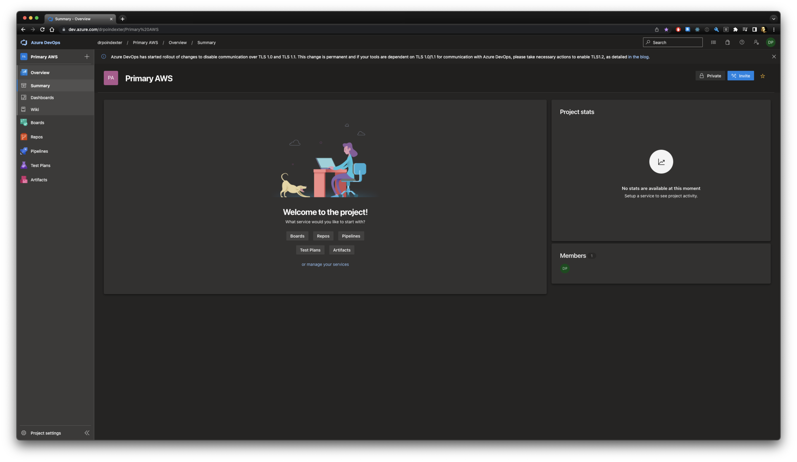
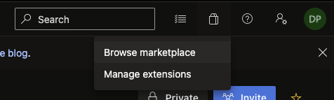

[Initial Article to Start with](https://medium.com/@iambbarman/provisioning-infrastructure-on-aws-with-azure-devops-pipelines-and-aws-cdk-19b0ab5fc284)

_Warning, it's a Medium post_

## The following is a bunch of my gotchas when following some guides

### Clarification on the Prerequisites

### Minimum Permissions

> An active Amazon Account with an IAM user having **admin permissions** to provision needed resources and its Access Key ID and Secret Access Key.

No, you absolutely do not need admin permissions. Then what do you need? I'm glad you asked.

The following policy attached to the IAM user (who has a key/secret), is all you need to deploy a CDK v2 project:

```json
{
  "Version": "2012-10-17",
  "Statement": [
    {
      "Action": ["sts:AssumeRole", "iam:PassRole"],
      "Resource": [
        "arn:aws:iam::<ACCOUNT_NUMBER>:role/cdk-hnb659fds-image-publishing-role-*",
        "arn:aws:iam::<ACCOUNT_NUMBER>:role/cdk-hnb659fds-deploy-role-*",
        "arn:aws:iam::<ACCOUNT_NUMBER>:role/cdk-hnb659fds-file-publishing-*",
        "arn:aws:iam::<ACCOUNT_NUMBER>:role/cdk-hnb659fds-lookup-role-*"
      ],
      "Effect": "Allow"
    }
  ]
}
```

### Enable the AWS Azure Toolkit Extension

When we sign up for Azure DevOps (ADO) and create our first project, we are dropped into this very empty dashboard.



Where do we find this required extension? Where do we find any extension?

I thought, well what about Project Settings at the bottom-left? No. In fact, it is hidden way up top-right in the cluster of icons that you are just supposed to know what they are.



We should use the icon that looks like a shopping bag. Obviously. Because it's from the extension marketplace. I say, dripping with sarcasm. Seriously, whoever thought that was a wise choice, I hope at least one other person recognized this icon.

If this note saved you even 15 minutes, good. I spent a solid 30 minutes clicking every single thing, up to the organization level settings, to find this... little... shopping bag.

### Unmentioned first steps

- Go to project settings and connect your github account. This is important because all of our code is in github, not in the ADO repositories.

- Select a repository, or several

- Create a service connection. This requires the IAM user key/secret, and optionally a role ARN (for cross account deployments in some cases)

### The dirty truth on Azure pricing

You do not get free tier anything with builds. Nothing. Nada.

You follow these steps, even after making your Github repo public, and you will find this fun error message

```
##[error]No hosted parallelism has been purchased or granted. To request a free parallelism grant, please fill out the following form https://aka.ms/azpipelines-parallelism-request
```

What this means is that you are not allowed to use this feature unless you do one of 2 things

1. Follow the instructions. Wait 2 to 3 days for your request to be reviewed, and another 7 to 15 days for it to be processed, or
1. Fork over a commitment of $40 USD per month for ONE parallel job

And this is to get one image spun up, install node, and run a basic npm install and an empty npm build command.

Microsoft... please do better. You were really starting to change my viewpoint but this is just underhanded and dirty tactics that remind me too much of the inglorious past of hidden fees and license issues of yesteryear.

### TODO

We will pause this effort while I dive further into how to resolve this and also not be swindled...
