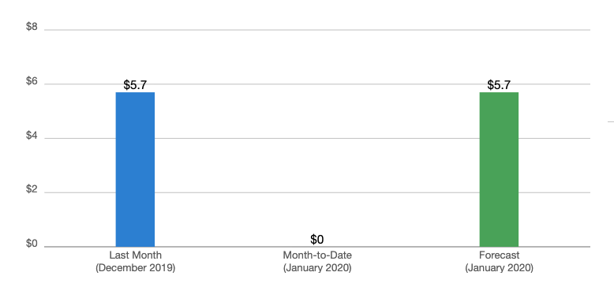

Well, not inherently, no.

And for web developers and authors on the web, it can be ridiculously cheap, but highly scalable and unbelievably resilient.

4 AWS Accounts under an Organization. The most active is Amplify and Gatsby sites running things... like this site you're looking at.

The largest cost is the Route53 Hosted Zones which are 50 cents each.

The non-route53 costs? It's that 70 cents.
