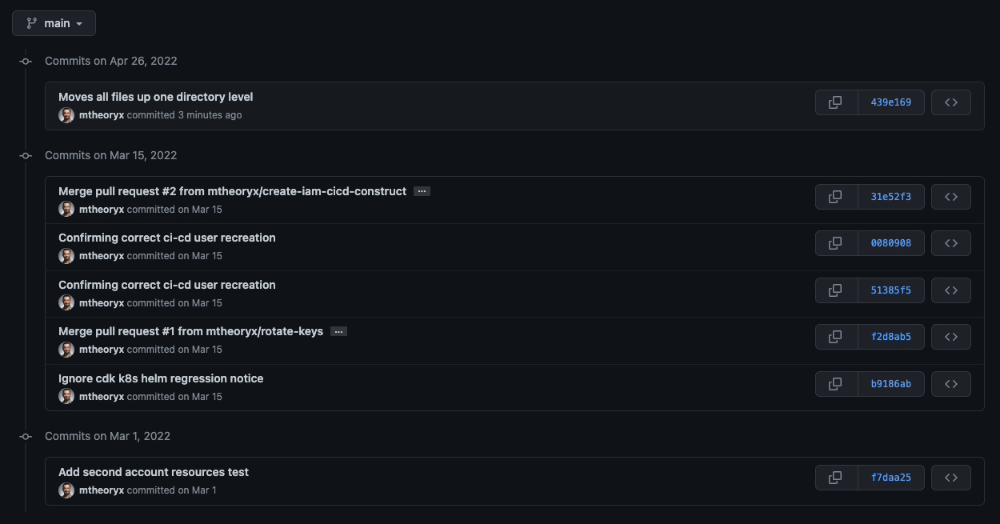

Configuring a monorepo for Azure DevOps doesn't seem too difficult. [I found a great guide with a Github repo example](https://julie.io/writing/monorepo-pipelines-in-azure-devops/)

This is great if you have a repo with a directory structure and concerns kinda like this:

```bash
main-monorepo-folder/
|-> service-a/
|-> service-b/
|-> service-c/
```

However, my user case is not really a "service" monorepo. It's just a place where I have 3 very different concerns that have no good reason living together. It's honestly an evolved version of a lazy PoC for something.

Current Repository Structure:

```bash
main-monorepo-folder/
|-> iam-cicd-users-iac/
|-> iam-cicd-key-rotation-system/
|-> cdk-cicd-deploy-permissions-validation/
```

What I'd like to do is split these directories up into their own Github repos, and specifically create a pipeline for them in Azure Devops (or Github actions, perhaps as a learning endeavor in the future) and simplify the whole mess.

We'll do this one at a time, just to be precise, and also do `git mv` to retain file history when we pop the files out to the top level.

[Here's the guide I was following as I went about this very topic, straight from Github themselves.](https://docs.github.com/en/get-started/using-git/splitting-a-subfolder-out-into-a-new-repository)

Make a whole new directory space. I made one under my `~/code/personal` directory `aws-iac-resources` to better identify (to myself) that this is where I manage my top-level resources via any IaC tech (CDK, Terraform)

In there, clone the private repo down fresh to a custom named folder (the argument after the command), then change into that new directory and subdirectory

```bash
git clone git@github.com:mtheoryx/iam-manager.git ci-cd-experiment &&\
cd ci-cd-experiment
```

Unfortunately, it appears that the recommended command `git filter-repo` is not a builtin, but rather an external product

[git-filter-repo command project](https://github.com/newren/git-filter-repo)

Time to install it! [From the install documentation, it looks like this is available via Homebrew](https://github.com/newren/git-filter-repo/blob/main/INSTALL.md)

```bash
brew install git-filter-repo
Running `brew update --preinstall`...
```

This took a while to run, but did finally complete.

Time to try running the git filter-repo command...

```bash
git filter-repo --path ci-cd-experiment/
```

Which worked perfectly! (Caveat, no idea if anything else brew-related or python-related was borked by installing this, I'll update this note if I notice anything)

I'll choose one of the least important directories to turn into a repo, targeting the one where I was merely experimenting if I could use my iac-controlled IAM user to create an S3 bucket in a whole different account via roles and trust settings.

First, create a new private repository and push it. You could do this via the UI, but I like using the `hub` utility for this, [which I previously wrote about here](https://www.dpoindexter.com/garden/create-and-publish-git-using-main/), but because we are technically already in an existing repository, this did not work one bit.

So, off to the UI to create a new one. I'll stick to the same naming convention, it can be changed later.

After this, we change the remote url

```bash
git remote add origin https://github.com/mtheoryx/ci-cd-experiment.git
```

And now we push the new repo (with all our history tagging along)

```bash
git push -u origin main
```

Now we can move onto reforming this subdirectory's contents to be at the top level of the new repo. Our strategy is to use git's native move command.

From the top level of this repo, we will now see it like this:

```bash
ci-cd-experiment/
|-> ci-cd-experiment/
|-> .git
```

We want to get a flatter structure, retaining history. And we can do a dry run with the `-n` or `--dry-run` option to report what would happen without actually changing anything.

```bash
git mv -n ci-cd-experiment/* .
```

Things look good, I see all the things I'd expect to see (and a few things I should re-think commiting, like some cdk files) so let's give it a go and check the git status!

```bash
git mv ci-cd-experiment/* .
```

So far, so good! But there are 2 hidden files not moved that we can move manually. I'm sure there is some way that I didn't notice to also move hidden files. That is the `.gitifgnore` and `.npmignore` files under that subdirectory.

We'll move those now, and also delete the now-empty subdirectory and check our status.

```bash
git mv ci-cd-experiment/.gitignore . && \
git mv ci-cd-experiment/.npmignore . && \
rm -d ci-cd-experiment/
```

And with that, we have git-recorded renames to commit and push. Let's do so, and validate we have retained our git history of changes on some files.

```
git add . && \
git commit -m 'Moves all files up one directory level' && \
git push
```

And now we can see that we retained our commit history on this new repo, after moving out of the original repo!



The only remaining steps for me are to rinse and repeat this two more times for my other more important projects.
