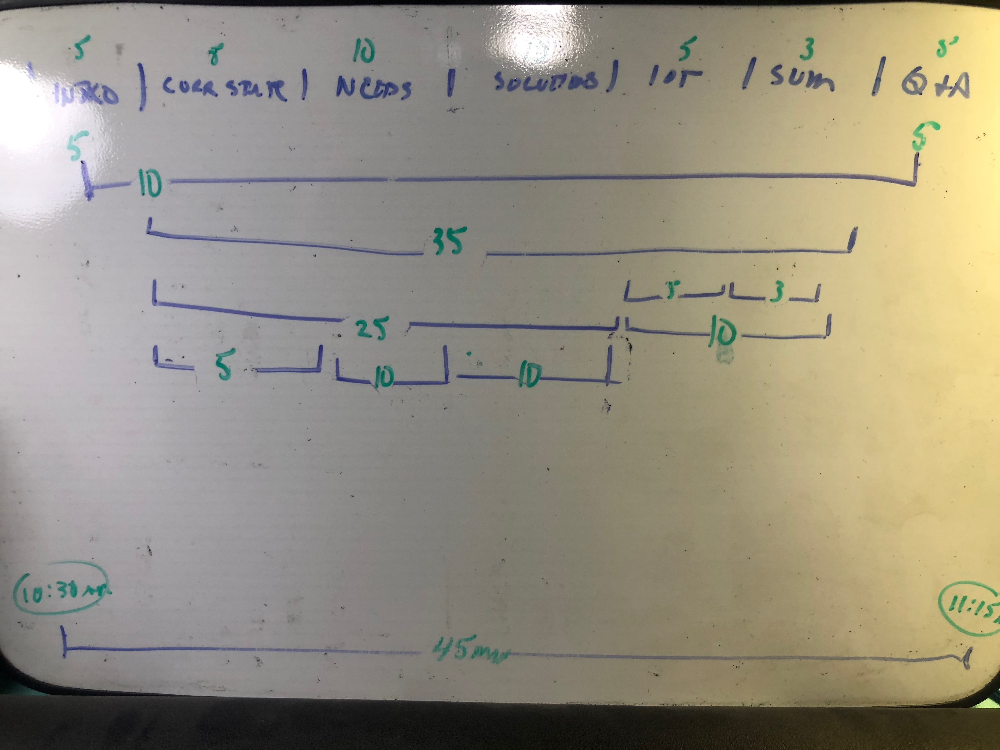
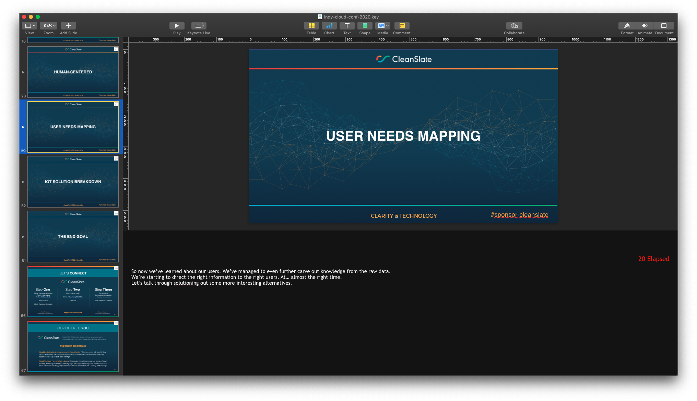
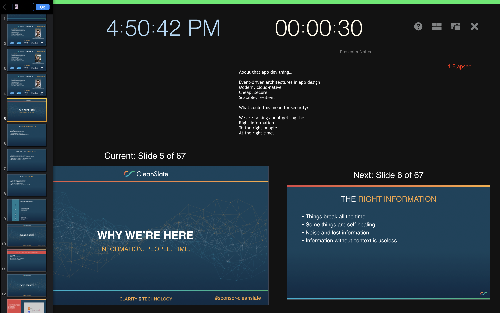

## Map out the presentation

Here's how I like to map out a presentation. It's not the best, but it does allow me to quickly re-arrange and iterate on timing.

I can then try rehearsing and notice when things are taking too long, or going too quickly.

## Make markers for elapsed time

Speaking of timing, make sure you add some indicators in your speaker notes. I prever something like the following on the major slides.

## Show the elapsted time and speaker notes

I prefer to place my notes higher up in the presenter screen.

This works well for in person and remote conferences.

For in-person conferences, you will not look all the way down at your current/prev slides and you maintain at least a bit more eye-level.

It's even better for a remote conference! You want to look as directly into the webcam as possible, and the notes are now just below that mark.

Additionally I key everything off the "elapsed time" timer because that doesn't depend on when your give a talk. And you don't have to change anything to present the content again somewhere else.

What are your tips?
